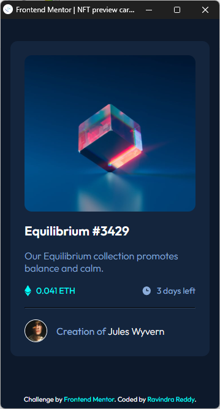

# Frontend Mentor - NFT preview card component


This is a solution to the [NFT preview card component challenge on Frontend Mentor](https://www.frontendmentor.io/challenges/nft-preview-card-component-SbdUL_w0U). Frontend Mentor challenges help you improve your coding skills by building realistic projects. 

## Table of contents

- [Overview](#overview)
  - [The challenge](#the-challenge)
  - [Screenshot](#screenshot)
  - [Links](#links)
- [My process](#my-process)
  - [Built with](#built-with)
  - [What I learned](#what-i-learned)
  - [Useful resources](#useful-resources)
- [Author](#author)

## Overview

### The challenge

Users should be able to:

- View the optimal layout depending on their device's screen size
- See hover states for interactive elements

### Screenshot

1. Desktop View -


2. Mobile View -



3. Hover Effect -


### Links

- Solution URL: [Github Repo](https://github.com/ravindra135/FrontendMentor-nft-preview-card-component-main)
- Live Site URL: [Watch Live Now](https://your-live-site-url.com)

## My process

### Built with

- Semantic HTML5 markup
- CSS custom properties
- Flexbox


### What I learned

- Best part of this challenge is, Displaying another element over Image on hover, with **z-index property**. Check small snippet of code below, also all section of the codes are commented, check ***styles.css***.

```css
/* When Hover, this is to be displayed. */
.main-eye-container {
    position: absolute;
    top: 45%;
    left: 45%;
    height: 40px;
    width: 40px;
    z-index: -1;
    /* z-index set to -1 which means this container is stacked back of the main-image. */
    display: flex;
}
/* When Hovered on image container, eye-container is stacked up using z-index property */
.img-container:hover .main-eye-container {
    z-index: 1;
}
```

### Useful resources


- [Learn About CSS Layout Positioning](https://www.w3schools.com/css/css_positioning.asp)
- [Learn About Z-index Property](https://www.w3schools.com/cssref/pr_pos_z-index.asp)


## Author

- Frontend Mentor - [@ravindra135](https://www.frontendmentor.io/profile/ravindra135)
- Github - [@ravindra135](https://github.com/ravindra135/)
- Instagram - [@ravindra_since2k](https://www.instagram.com/ravindra_since2k/)